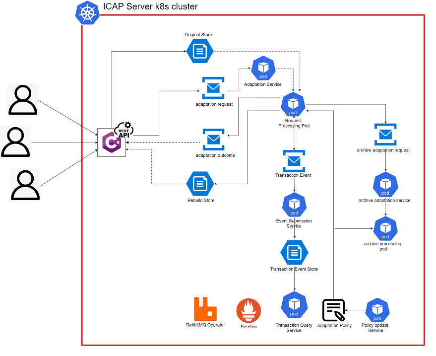
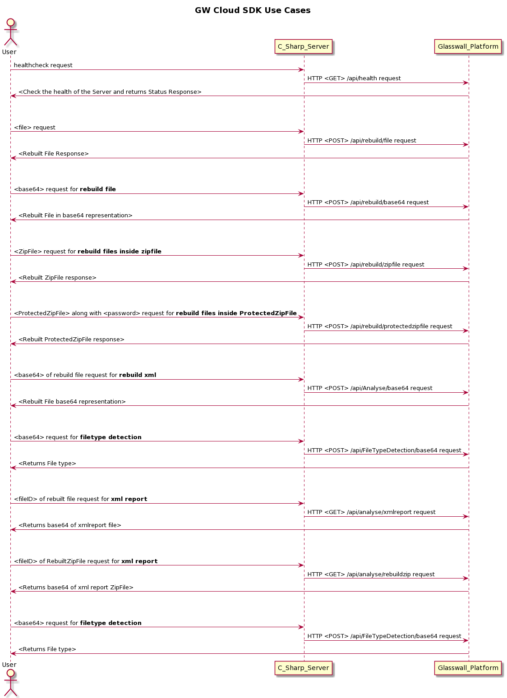

# C# Rest API for ICAP Service Kubernetes cluster

## The Project Overview

The project is about a Kubernetes service that can be added to [ICAP infrastructure](https://github.com/k8-proxy/icap-infrastructure) to provide access to Glasswall Solutions file rebuild service through RESTful APIs

## Architecture Diagram



- The C# service receives files for a rebuild on the REST API endpoints.  
- After preliminary processing (at least must verify the file has been received) the request is passed to the `Adaption Service` with `Adaption request` RabbitMQ     message.  
- The file to be rebuilt is uploaded to the `Original Store`.  
- Once the processing is completed C# service gets informed with a RabbitMQ `Adaption outcome` message.  
- C# service get the rebuilt file from the `Rebuild Store` and passes it to the user.  

## Dataflow Diagram



## The docker image

- Build the image with the following:  

    ```
    docker build -t cs-k8s-api --file Dockerfile .
    ```

- Tag the docker image:  

    ```
    docker image tag cs-k8s-api <dockerhub_repo>/cs-k8s-api:<version>
    ```

- Upload the tagged image to Docker Hub:  

    ```
    docker image push <dockerhub_repo>/cs-k8s-api:<version>
    ```

## Deployment within ICAP Service cluster

- Make sure you can connect to the cluster with `kubectl`  
- For the case of [AMI or OVA](https://github.com/k8-proxy/glasswall-servers-eval/wiki) just SSH to the EC2 instance or the VM
- For other deployments see [Accessing Clusters](https://kubernetes.io/docs/tasks/access-application-cluster/access-cluster/))

- Get [deployment.yaml](https://github.com/k8-proxy/cs-k8s-api/blob/main/deployment.yaml)

    ```
        wget https://raw.githubusercontent.com/k8-proxy/cs-k8s-api/main/deployment.yaml
    ```
- Replace `<REPLACE_IMAGE_ID>` within the file with the tagged (`<dockerhub_repo>/cs-k8s-api:<version>`) docker hub image created in the previous section  

- Run the following:

    ```
        kubectl -n icap-adaptation apply -f deployment.yaml
    ```

- The command above must create a Kubernetes service called `proxy-rest-api` that can be accessed at <Cluster_IPv4>:8080  

- Verify the service has been successfully created  

    ```
        kubectl -n icap-adaptation get svc
    ```

- The output should contain a line that looks like the following:

    ```
        ...
        proxy-rest-api              LoadBalancer   10.43.236.137   91.109.25.86   8080:30329/TCP
        ...
    ```

- Verify that the service POD is running  

    ```
        kubectl -n icap-adaptation get pods
    ```
- You should see the POD in the `Running` state  

    ```
        proxy-rest-api-7b7d5b6456-s44kq                         1/1     Running     0
    ```

## Implemented endpoints

#### api/FileTypeDetection/base64

The endpoint detects the uploaded file type

It accepts HTTP POST requests with:  

Headers:  
- Content-Type: application/json  

Payload:  
- base64 encoded file (see [base64.json](./Samples/base64.json))
  
On success, the output is JSON formated data like in the sample below:  
  
```
{
    "fileTypeName": "pdf",
    "fileSize": 189167
}
```
  
#### api/Analyse/base64

The endpoint analyses the file uploaded for a possibility to rebuild it.

It accepts HTTP POST requests with:  

Headers:  
- Content-Type: application/json  

Payload:  
- base64 encoded file (see [base64.json](./Samples/base64.json))
  
On success, the output is an XML formated report (see [report.xml](./Samples/report.xml))  

#### api/Rebuild/base64

The endpoint rebuilds the file uploaded.

It accepts HTTP POST requests with:  

Headers:  
- Content-Type: application/json  

Payload:  
- base64 encoded file (see [base64.json](./Samples/base64.json))
  
On success, the output is a base64 encoded cleaned up file  

### api/Rebuld/file

The endpoint rebuilds the file uploaded.

It accepts HTTP POST requests with:  

Headers:  
- Content-Type: multipart/form-data

Payload:  
- form-data with `file` named field that contains the file binary
  
On success, the output is the cleaned up file binary
